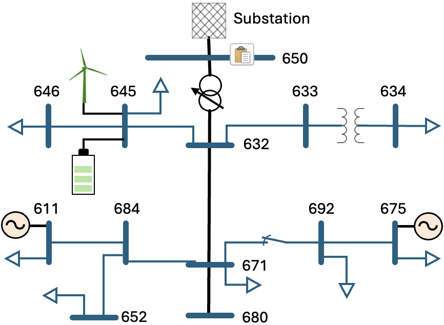
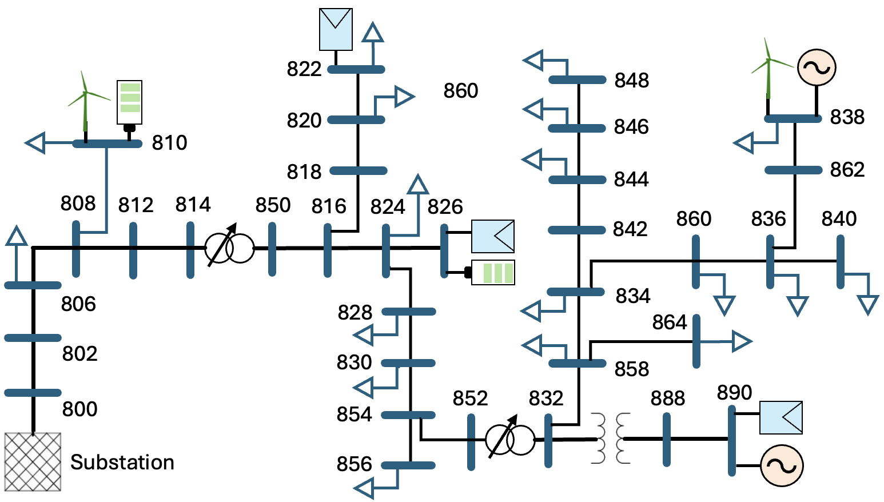

# PowerGrid Gym Environment

A lightweight, production-style **Gymnasium** environment for **power grid control**, built on [pandapower](https://www.pandapower.org/).  
It provides modular device models (DG, RES, ESS, Shunt, Transformer, Grid) with clean action/observation spaces, centralized safety metrics, and pluggable rewards — designed for Reinforcement Learning (RL) and Multi-Agent RL research.

---

## Highlights

- ⚡ **Plug-and-play devices**: `DG`, `RES` (solar/wind), `ESS`, `Shunt`, `Transformer` (OLTC), `Grid`, `Switch`
- 🔌 **Pandapower integration** with idempotent device → network attachment
- 🧩 **Gymnasium-compatible** single-agent base (`GridBaseEnv`)
- 🎛️ **Mixed action spaces**: continuous (`Box`) and discrete (`Discrete` / `MultiDiscrete`) combined in a `Dict`
- 🔄 **NormalizeActionWrapper**: agents act in `[-1, 1]`, environment rescales to physical ranges
- 🛡️ **Safety framework** (`SafetySpec`, `total_safety`) for penalties: over-rating, power factor, SOC, voltage, line loading, etc.
- 💰 **Cost helpers**: quadratic, piecewise linear, ramping, tap wear, energy settlement
- ✅ **Unit tests** for devices and environment logic
- 🧪 **RL-ready**: works with Stable-Baselines3, RLlib, and custom Gym agents

---

## Installation

### Conda (recommended on macOS/Ubuntu)

```bash
# Create an environment
conda create -n powergrid python=3.12 -y
conda activate powergrid
pip install -U pip
pip install -e .

# Or direct setup with pip
pip install -r requirements.txt
```

# Quick Start
```bash
from powergrid.envs.single_agent.ieee13_mg import IEEE13Env

# Create and wrap: agent acts in [-1,1] for the continuous part
env = IEEE13Env({"episode_length": 24, "train": True})
obs, info = env.reset()

# Take a random step
action = env.action_space.sample()
obs, reward, terminated, truncated, info = env.step(action)
print("reward=", reward, "converged=", info.get("converged"))
```

## Action Space

- **Continuous:** concatenated device controls (e.g., DG P/Q, ESS P/Q, RES Q)  
- **Discrete:** optional categoricals (e.g., transformer taps)  

- **Exposed as:**
    - pure continuous → `Box`  
    - mixed → `Dict({"continuous": Box, "discrete": Discrete|MultiDiscrete})`  

**Tip:** wrap with `NormalizeActionWrapper` if your agent outputs values in `[-1, 1]`;  
the environment automatically rescales to true physical ranges internally.

## Example Networks

This repository includes standard IEEE test systems used for demonstration and validation.  
Below are the single-line diagrams of two networks:

### IEEE 13-Bus System


### IEEE 34-Bus System

